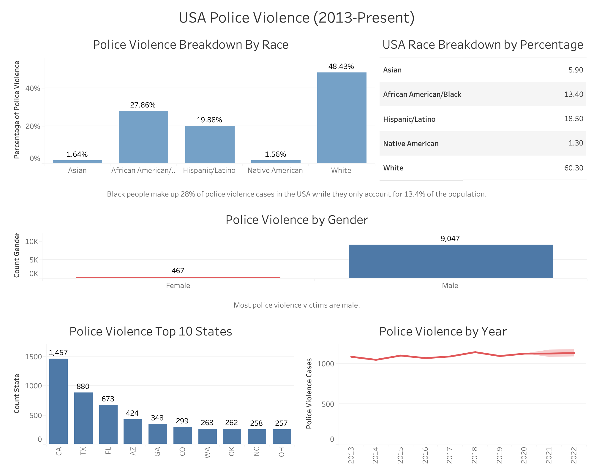

# Introduction

US Police Violence has become a major problem in the United States of America. Using data from kaggle we have created a data dashboard to answer the following questions powered by Tableau.

Link to Data: https://www.kaggle.com/jamesvandenberg/us-police-shootings-20132020

### Questions

1. Are certain races more likely to be victims of police violence than others?
2. What is the gender of most of the victims?
3. Which states have the most police violence cases?
4. Is police violence getting better over time?

